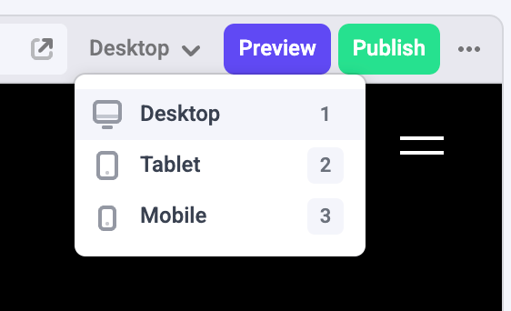

## Introduction

By default Makeswift has one base breakpoint `desktop`, and two additional breakpoints, `tablet` and `mobile`:



You can use the breakpoints dropdown to view your site on different devices and build responsively.

<video src="../images/change-breakpoint-dropdown.mp4" autoPlay muted loop />

The default breakpoints are great for starting a new site, but for integrating a site with existing media queries it's better to setup custom breakpoints to match.

## Usage

<Warning>
  Custom breakpoints are only available with the new API pattern. Note that you need to pass the
  `runtime` instance to the `Makeswift` component and `MakeswiftPage` component.
</Warning>

To use the new API pattern and custom breakpoints, you first need to import `ReactRuntime`, and create an instance
while passing the `breakpoints` option to the constructor:

```jsx
import { ReactRuntime } from '@makeswift/runtime/react'

const runtime = new ReactRuntime({
  breakpoints: {
    tablet: { width: 768, viewport: 760, label: 'Tablet' },
    phablet: { width: 640 },
    mobile: { width: 575, viewport: 390, label: 'Mobile' },
  },
})
```

- `width` is the value used in the media query. Width is **required**.
- `viewport` is is the size of the preview we show in app.makeswift.com when you are building. Viewport is **optional** and falls back to width.
- `label` is the text shown in the breakpoint dropdown. Label is **optional** and falls back to the key it is assigned to.

  Example: The second breakpoint above doesn't have a label, so the text used in the breakpoint dropdown is `phablet`.

Then make sure your component registration uses the runtime instance instead of the global `ReactRuntime`:

```diff
- ReactRuntime.registerComponent(...)
+ runtime.registerComponent(HelloWorld, {
  type: "hello-world",
  label: "Hello world",
  props: {
    className: Style(),
    ...
  },
});
```

Then pass the runtime instance to `Makeswift` and `MakeswiftPage`, usually located in file `[[...path]].tsx` or `[[...path]].jsx`:

```jsx
export async function getStaticPaths() {
  const makeswift = new Makeswift(process.env.MAKESWIFT_SITE_API_KEY!, {
    runtime: runtime, // Pass the runtime here
  });

  // ...
}

export async function getStaticProps(ctx) {
  const makeswift = new Makeswift(process.env.MAKESWIFT_SITE_API_KEY!, {
    runtime: runtime, // Pass the runtime here
  });

  // ...
}

export default function Page({ snapshot }) {
  return (
    <MakeswiftPage
      snapshot={snapshot}
      runtime={runtime} {/* and here */}
    />
  );
}
```

## Important Notes

- Makeswift currently only supports **desktop-first** responsiveness. We may support for mobile-first responsiveness in the future. Let us know if mobile-first responsiveness is important to you.
- The `desktop` breakpoint is always added, and its value is calculated based on the largest custom breakpoint.

## API

### Types

```ts
type Breakpoint = {
  width: number
  viewport?: number
  label?: string
}

type BreakpointsInput = Record<string, Breakpoint>
```