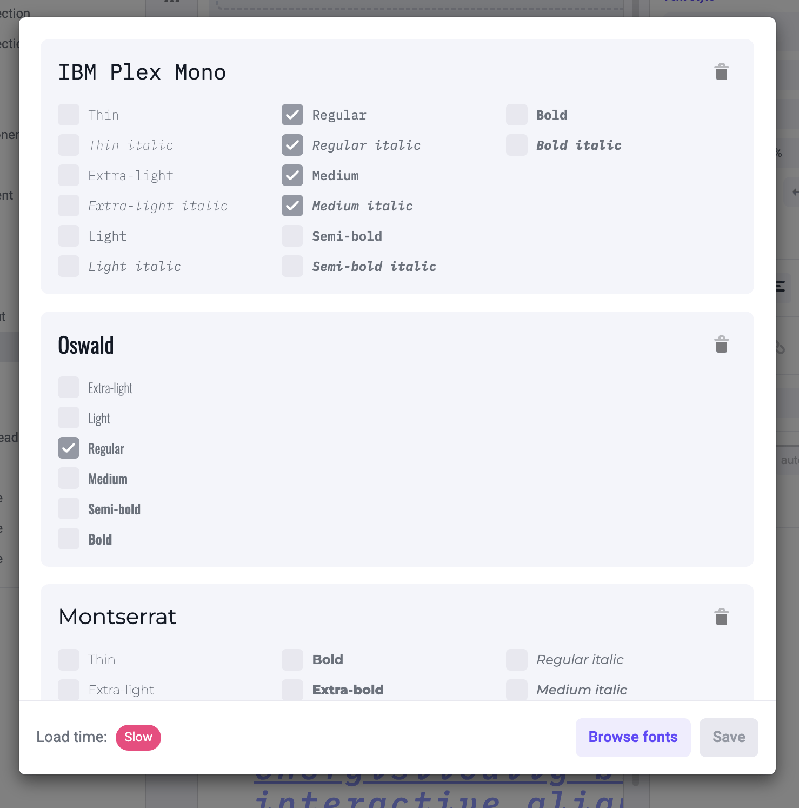

Registering fonts is a way to add fonts to the builder so you can select them in the font dropdown.

**You still need to install the font in the Next.js app by yourself.** Some common ways to do it are either by
adding a font face declaration in the CSS file, or by adding a Google Font snippet in the `<head>` tag.

Registering a font enables you to:

- Use a custom font that's not available on Google Fonts in the builder.
- Use a font that's already installed on your Next.js app in the builder.

---

If your font is available on Google Fonts, or if you haven't installed your font yet, it's easier
to add the font directly from the builder. We will add and install the font automatically for you.

