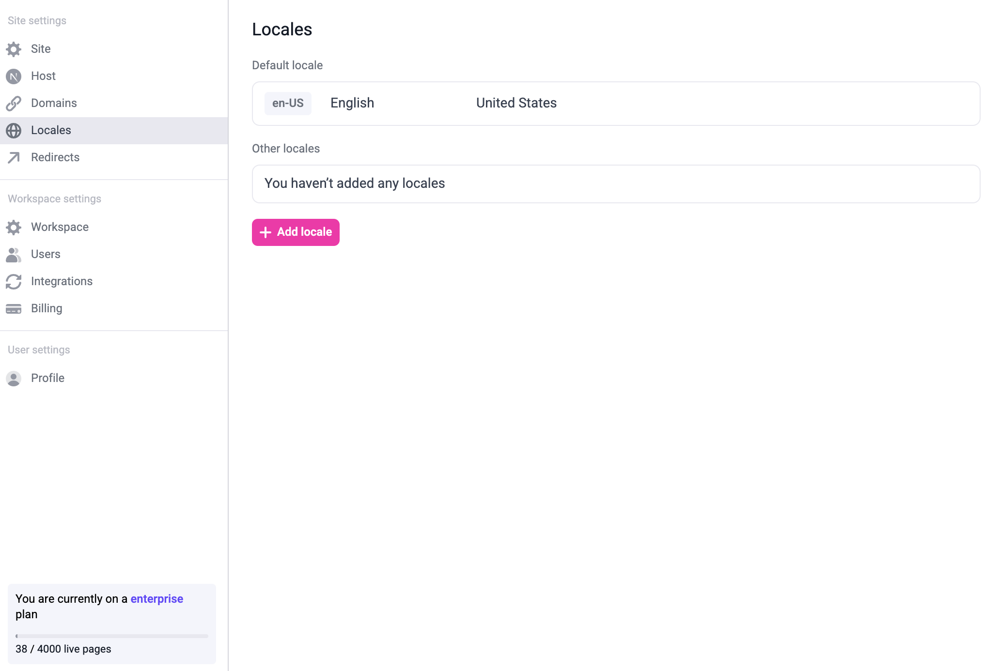
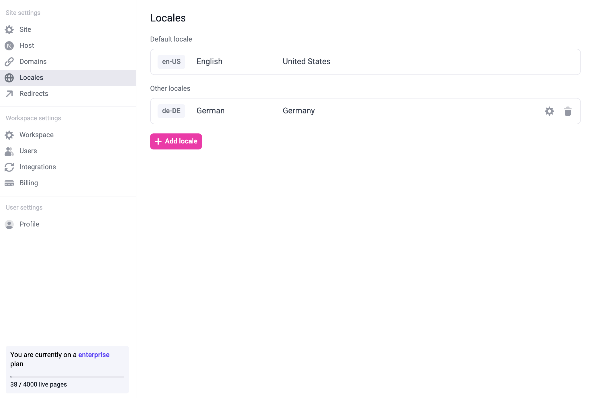
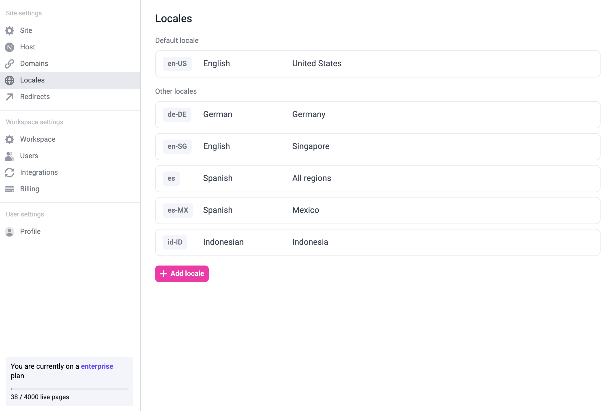
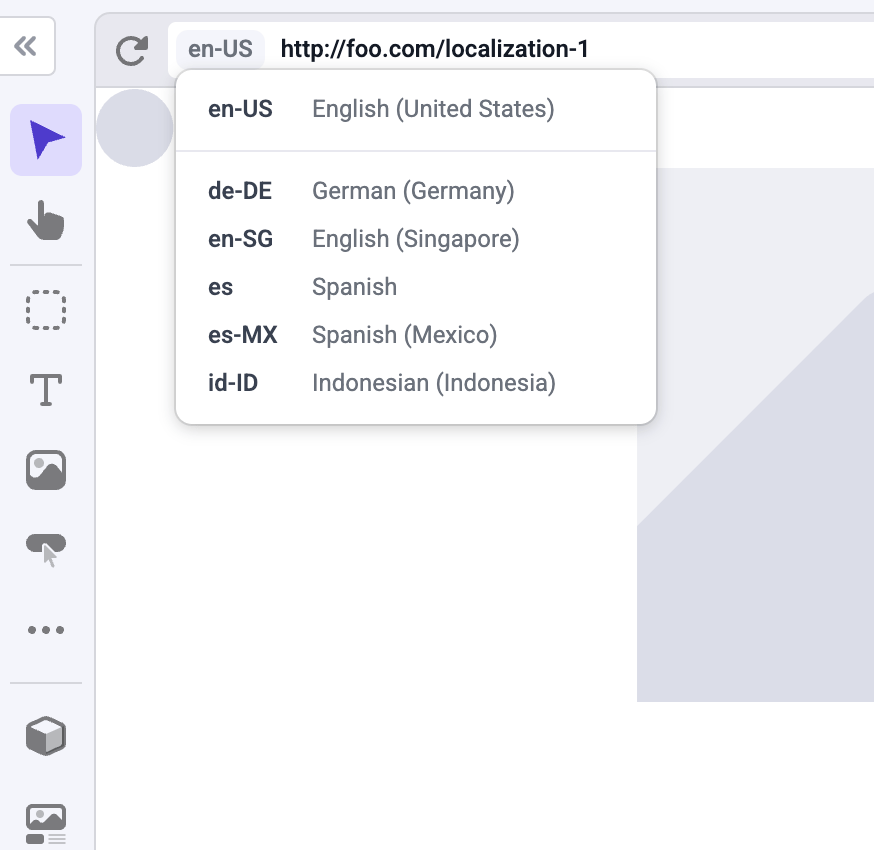
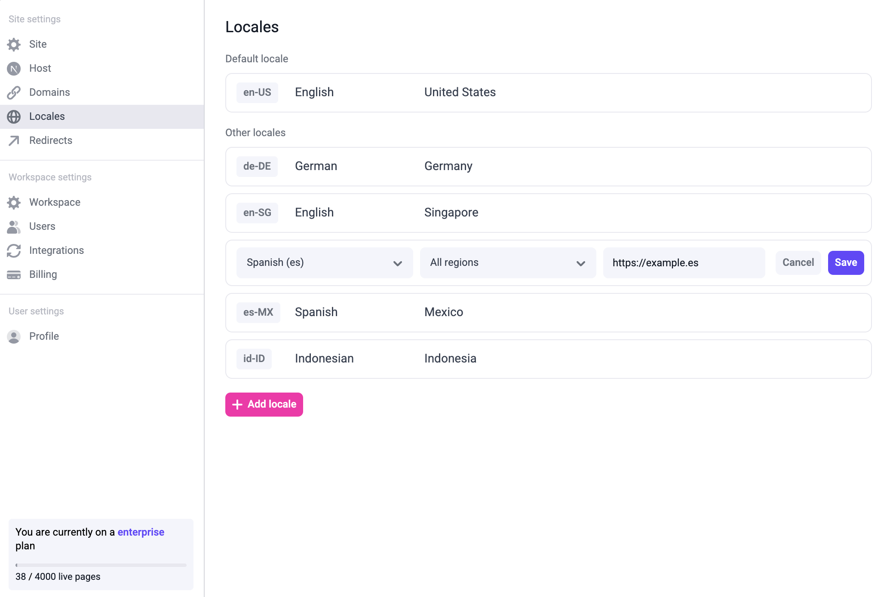

Makeswift's support for localization allows you to visually edit your site for different locales.
The feature is deeply integrated with [Next.js' Internationalization features](https://nextjs.org/docs/app/building-your-application/routing/internationalization).

For example, if you have a company page at `example.com/company` you can create the Spanish version of the page at `example.com/es/compania` or `example.es/compania`.

<Warning>

Localization is currently only available on the Enterprise plan.
Reach out to support at [support@makeswift.com](mailto:support@makeswift.com) if you want to enable this feature.

</Warning>

## Getting started

### Managing locales in the settings

To get started, open site settings and go to the "Locales" tab:



To add a new locale, click the "+ Add locale" button. You can modify or delete existing locales by hovering over the locale:



You can also modify the default locale by hovering over the default locale and clicking the edit button.

Once you add all the locales you need, it might look like this:



### Configuring locales in the Next.js config

The locales in your site settings need to match the locales configured in `next.config.js`. For example, to match the locales on the screenshot above,
we need to update `next.config.js` to be like this:

```ts
const nextConfig = {
  i18n: {
    defaultLocale: 'en-US',
    locales: ['en-US', 'de-DE', 'en-SG', 'es', 'es-MX', 'id-ID'],
  },
}
```

Note that in `next.config.js`, you also need to put your `defaultLocale` to the `locales`.
For example, here, we're adding `en-US` to the `locales`.

It is important to match the locales and the default locale on the site settings to the locales configured in `next.config.js`, otherwise
the pages on the builder will not load properly.

### Updating `getStaticProps`

Once you set up locales in the site settings and in the Next.js config, you need to pass the locale from `getStaticProps`'s `ctx` to `getPageSnapshot`.

```diff
export async function getStaticProps(ctx) {
  // ...

  const snapshot = await makeswift.getPageSnapshot(path, {
    siteVersion: Makeswift.getSiteVersion(ctx.previewData),
+   locale: ctx.locale,
  });
}
```

This code is usually located in `[[...path]].tsx`, but it might be different depending on your setup.

### Editing localized pages in the builder

Once you've set everything up, you should be able to switch to the locale using the locale switcher on the builder.



### Domain-based localization

If you don't provide a domain for a locale, the localized pages will be located on the same domain as the default locale,
but nested on the locale's path. For example, `es` pages will be located on `example.com/es/page`.

To use domain-based localization, first, add the domain to the locale on your site settings:



Then, add the domain to your `next.config.js`:

```ts
const nextConfig = {
  i18n: {
    defaultLocale: 'en-US',
    locales: ['en-US', 'de-DE', 'en-SG', 'es', 'es-MX', 'id-ID'],
    domains: [
      {
        domain: 'example.es',
        defaultLocale: 'es',
      },
    ],
  },
}
```

Once you have done that, the Spanish localized pages will be located on `example.es/page`.

### Localized resources

When making changes on a different locale you can override any property, including the page's pathname, metadata, and SEO tags.

You can also localize a global component. To do this, edit a global component within a localized page, make changes,
and then save the global component. Then, that global component will be saved for that locale.