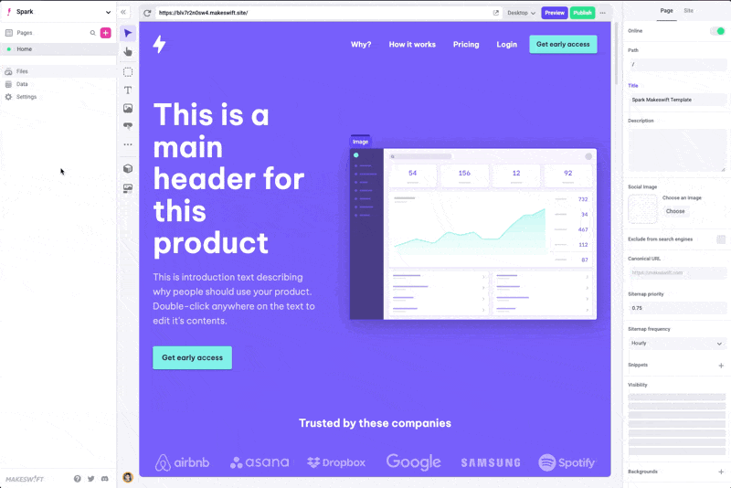
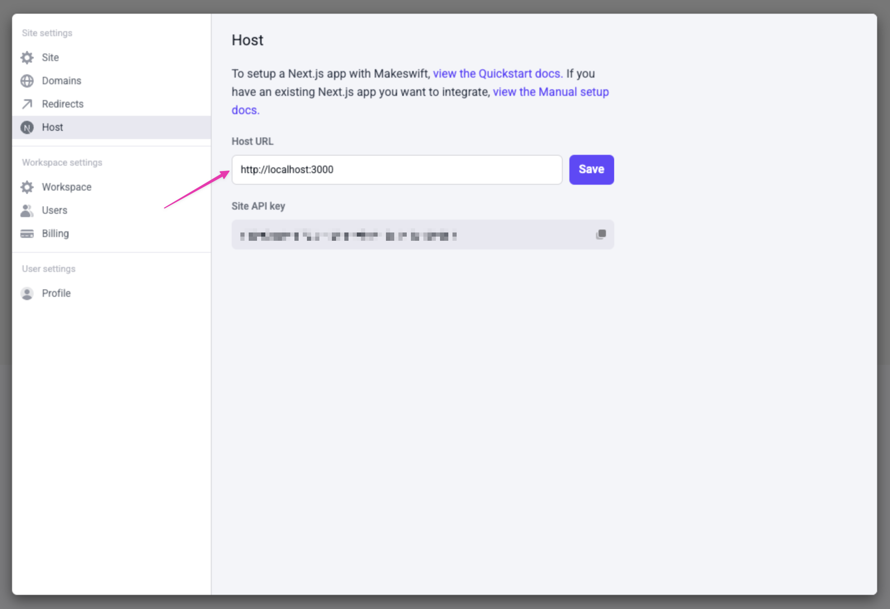

# Before you start

The fastest way to get started with Makeswift on a new Next.js project is to follow the
[getting started guide](/quickstart). If you have an existing Next.js application
or want to set things up yourself, continue with the rest of this guide.

## System Requirements:

- [Node.js 18.17](https://nodejs.org/en) or a later version.
- macOS, Windows (including WSL), and Linux are supported.

# Open your Next.js project

First, open a Next.js project. If you don't already have one, head over to the [Next.js](https://nextjs.org/docs/getting-started/installation) documentation to get one set up. If you do have one, please verify you are using [Next.js 12](https://nextjs.org/blog/next-12) or a later version.

# Install dependencies

Install the `@makeswift/runtime` package. This package contains all of the necessary
code to integrate Makeswift into your Next.js app.

```bash filename="Terminal" icon="terminal"
npm install @makeswift/runtime
```

# <a name="api-key" />Add API key to environment variables

Requesting data through the `Makeswift` client requires a site API key from Makeswift. In the Makeswift builder, go to **Settings > Host** and copy the API key for the site.



Once the API key is in your clipboard, open your [`.env.local`](https://nextjs.org/docs/pages/building-your-application/configuring/environment-variables) file and paste the snippet below.

```sh filename=".env.local" icon="file" showLineNumbers
MAKESWIFT_SITE_API_KEY = paste-your-api-key-here
```

# <a name="client-installation"/>Add Makeswift runtime and client

Create a file for the Makeswift [runtime](/architecture#runtime) named `lib/makeswift/runtime.js`.

```js filename="lib/makeswift/runtime.js"
import { ReactRuntime } from '@makeswift/runtime/react'

export const runtime = new ReactRuntime()
```

Create a file for the Makeswift [client](/architecture#client) named `lib/makeswift/client.js`

```js filename="lib/makeswift/client.js" showLineNumbers
import { Makeswift } from '@makeswift/runtime/next'
import { runtime } from './runtime'

export const client = new Makeswift(process.env.MAKESWIFT_SITE_API_KEY, { runtime })
```

# <a name="api-handler" />Add the Makeswift API handler

Similar to [NextAuth.js](https://next-auth.js.org/), Makeswift uses an API handler to communicate with your Next.js app. Create the file `pages/api/makeswift/[...makeswift].js`. It's important that the file has that exact name, excluding
the extension, which can be `ts` if you're using TypeScript.

```js filename="pages/api/makeswift/[...makeswift].js" icon="js" showLineNumbers
import { MakeswiftApiHandler } from '@makeswift/runtime/next'

export default MakeswiftApiHandler(process.env.MAKESWIFT_SITE_API_KEY)
```

This API route will add support for
[Preview Mode](https://nextjs.org/advanced-features/preview-mode),
[On-demand Revalidation](https://nextjs.org/basic-features/data-fetching/incremental-static-regeneration#on-demand-revalidation),
and other features that make Makeswift work seamlessly with your Next.js app. Provide the Makeswift site API key [environment variable](https://nextjs.org/docs/pages/building-your-application/configuring/environment-variables) from the previous step as the first argument to the API handler function.

# <a name="next-plugin" />Add the Next.js plugin

Next.js plugins are configured in the project's next.config.js file by wrapping `nextConfig`. The Makeswift Next.js plugin whitelists Makeswift image domains and sets up rewrites to enable preview mode in the Makeswift builder. The following example shows you how to install the `withMakeswift` plugin.

```js filename="next.config.js" icon="js" showLineNumbers
const withMakeswift = require('@makeswift/runtime/next/plugin')()

const nextConfig = {
  /* Your Next.js config... */
}

module.exports = withMakeswift(nextConfig)
```

# <a name="custom-document" />Set up a custom Document

Create a [custom Document](https://nextjs.org/docs/pages/building-your-application/routing/custom-document) named `_document.js` and export `Document` from `@makeswift/runtime/next`. The Makeswift custom Document handles styles during server-side rendering and using [Preview Mode](https://nextjs.org/docs/pages/building-your-application/configuring/preview-mode) when opening your pages in the Makeswift builder.

```js filename="pages/_document.js" icon="js" showLineNumbers
export { Document as default } from '@makeswift/runtime/next'
```

If you already have a `_document.js`, you can update it to [extend the Document](guides/extending-the-document) from `@makeswift/runtime/next`.

# <a name="pages-route" />Add a route for Makeswift pages

Create an [optional catch-all route](https://nextjs.org/docs/pages/building-your-application/routing/dynamic-routes#optional-catch-all-segments) named `[[...path]].js`. You will use the `Makeswift` client to fetch page [snapshots](/architecture#snapshots) and pass it to the `MakeswiftPage` component to render.

{/* prettier-ignore-start */}
```jsx filename="pages/[[...path]].js" icon="js" showLineNumbers
import { Makeswift, Page as MakeswiftPage } from '@makeswift/runtime/next'
import { client } from '../lib/makeswift/client'
import { runtime } from '../lib/makeswift/runtime'

export async function getStaticPaths() {
  const pages = await client.getPages()

  return {
    paths: pages.map((page) => ({
      params: { path: page.path.split('/').filter((segment) => segment !== '') },
    })),
    fallback: 'blocking',
  }
}

export async function getStaticProps(ctx) {
  const path = '/' + (ctx.params?.path ?? []).join('/')
  const snapshot = await client.getPageSnapshot(path, { 
    siteVersion: Makeswift.getSiteVersion(ctx.previewData),
  })

  if (snapshot == null) return { notFound: true }

  return { props: { snapshot } }
}

export default function Page({ snapshot }) {
  return <MakeswiftPage snapshot={snapshot} runtime={runtime} />
}
```
{/* prettier-ignore-end */}

Important notes:

1. If you already have an `index.js` file, you will need to name the file `[...path.js]` instead of `[[...path.js]]`. For more information about the differences between catch-all and optional catch-all segments, refer to the Next.js [Catch-all segments](https://nextjs.org/docs/pages/building-your-application/routing/dynamic-routes#catch-all-segments) documentation.

2. The filename defines the `path` param. For example, if the filename is `[[...slug]].js` instead of `[[...path]].js`, then the param name is `slug`. Because this is an optional catch-all route, there are no params when visiting the index (i.e., `/`) path. The `path` param defaults to an empty array.

3. [`fallback: 'blocking'`](https://nextjs.org/docs/pages/api-reference/functions/get-static-paths#fallback-blocking) is used here so that your Next.js app doesn't need to be re-deployed whenever a new Makeswift page is created.

With this setup, your pages will be rendered using
[Incremental Static Regeneration](https://nextjs.org/basic-features/data-fetching/incremental-static-regeneration).
A `revalidate` field isn't added to the returned value of `getStaticProps` because
Makeswift pages are automatically revalidated using
[On-demand Revalidation](https://nextjs.org/basic-features/data-fetching/incremental-static-regeneration#on-demand-revalidation)
by levaraging the [Makeswift API handler](#api-handler).

# Register components with Makeswift

Create a file for registered components called `lib/makeswift/components.js`. In this example, only one component is registered. However, as you register more components, we recommend creating separate files for each component and rolling up the imports in the `lib/makeswift/components.js` file. Learn more about [registering components](/essentials/components).

```js filename="lib/makeswift/components.js" icon="js" showLineNumbers
import { ReactRuntime } from '@makeswift/runtime/react'
import { Style } from '@makeswift/runtime/controls'

function HelloWorld(props) {
  return <p {...props}>Hello, world!</p>
}

ReactRuntime.registerComponent(HelloWorld, {
  type: 'hello-world',
  label: 'Hello, world!',
  props: {
    className: Style(),
  },
})
```

Lastly, add this import to the catch-all route `pages/[[...path]].js` created earlier.

{/* prettier-ignore-start */}
```diff-js filename="pages/[[...path]].js" icon="js" showLineNumbers
import { Makeswift, Page as MakeswiftPage } from '@makeswift/runtime/next'
import { client } from '../lib/makeswift/client'
import { runtime } from '../lib/makeswift/runtime'
+ import '../lib/makeswift/components'
```
{/* prettier-ignore-end */}

# Start the local dev server

Run the local development script. This will start the Next.js app at `http://localhost:3000`.

```bash filename="terminal" icon="terminal"
npm run dev
```

If port `3000` is already in use, Next.js will try port `3001`, then `3002`, and so forth until an
unused port is found. Take note of this port for the next step.

# Add your app's URL to Makeswift

Finally, open the Makeswift builder, navigate to **Settings > Host**, and add your app's URL. If you haven't changed anything in the example and the server is running on port `3000`, the app's URL should be
`http://localhost:3000`.



When you're ready to deploy, set up a separate site and use your deployment URL
instead of `localhost`. You can keep this site for local development. Read more about [deploying to production](/guides/deploying-to-production).

# Start building

Great job! You should be able to create a page in Makeswift and start dropping in registered
components from the left toolbar.

