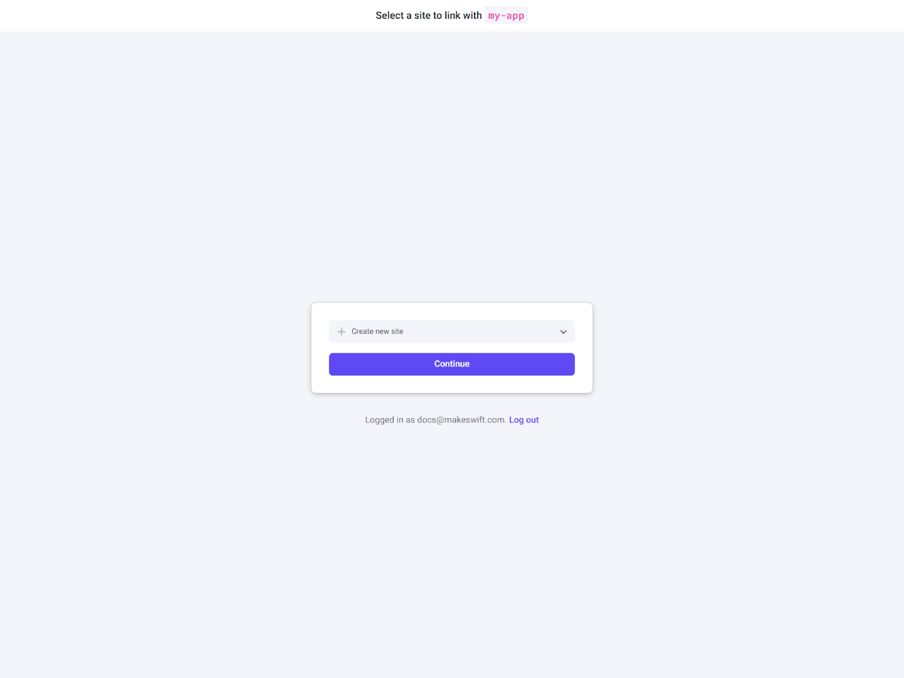
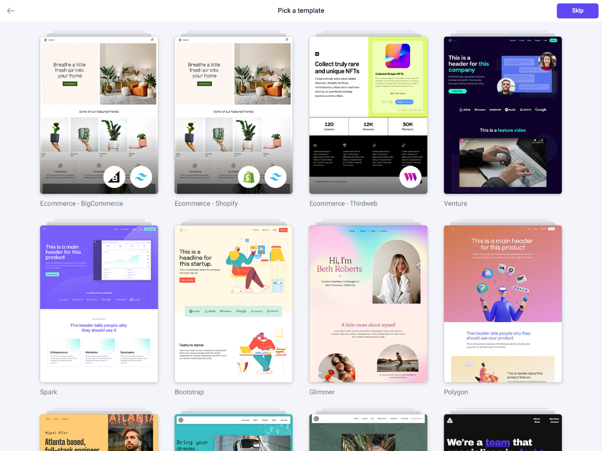
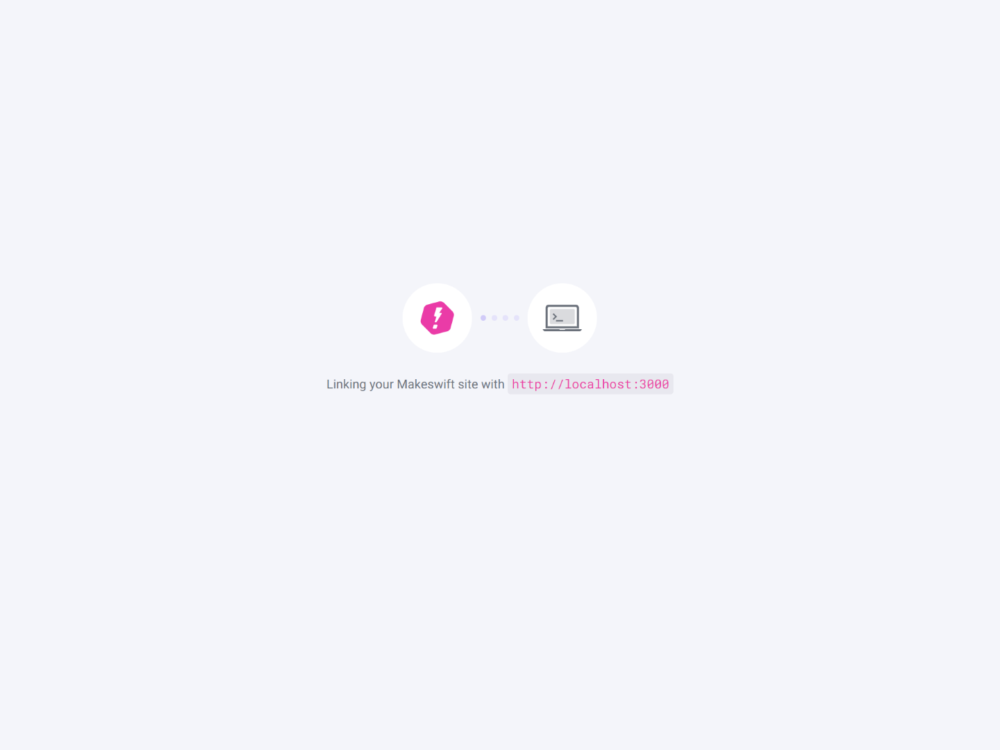
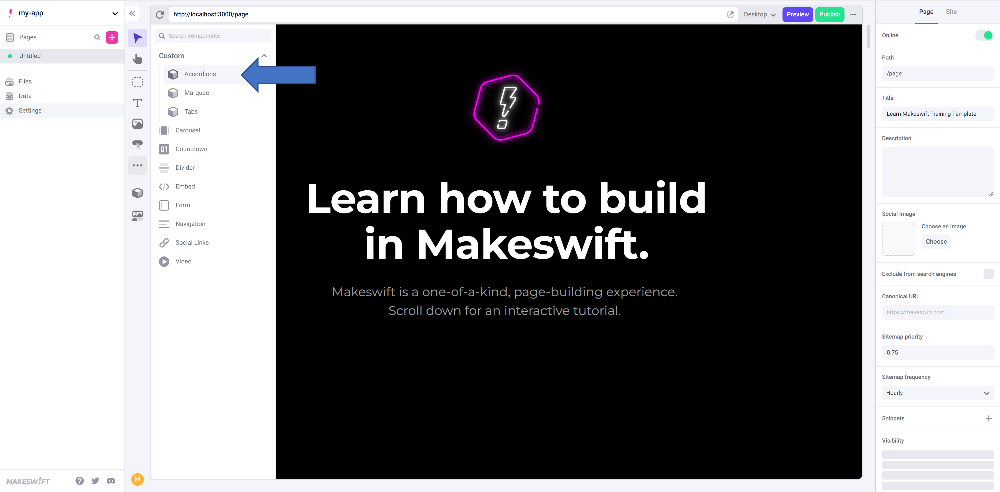

# Setting up Makeswift 

You can integrate a local Next.js app with a Makeswift site using an automatic or manual setup. You can integrate new or existing Next.js apps; however, we recommend using the [Manual Installation](/guide/manual-installation) guide for existing apps. 

This guide shows you how to integrate a Next.js app for a local development environment using an automatic setup. 

## Prerequisites

You will need the following:
- Node.js. See (Next.js)(https://nextjs.org/docs/getting-started/installation) for version requirements.
- Experience building Next.js applications

You don't need an existing Makeswift site to complete this guide. 

## Automatic setup

Set up a new Next.js app or integrate an existing Next.js app with Makeswift using the CLI.

### Initialize the app

1. Navigate into a project folder or into the root directory for an existing project.

```bash
cd example-project-folder
```

2. Perform the following command in the CLI: 

```bash
npx makeswift@latest init
```

If you are setting up a new Next.js app, the CLI returns the following output and creates a new app to be connected to Makeswift.

``` 
// CLI output for a new Next.js app

? What would you like to name your project? (my-app)
```

If you are working with an existing Next.js app, the CLI returns the following output. After you confirm you'd like to integrate your app, the CLI generates all the necessary files in the project folder. 

```
// CLI output for an existing Next.js app

? It appears this directory is an existing Next.js app — would you like to use it? (Y/n)
```

The CLI then opens a new page in your browser where you will continue integrating your app.

### Connect the Next.js app to a Makeswift site

The browser will prompt you to select a Makeswift site to connect to your local Next.js app. You may need to login or sign up, but the browser will redirect you to this page.

1. Select an existing site or create a new one.



2. Pick a template (optional).



3. Check the CLI for any prompts when the Makeswift site is being linked to `localhost`. During this step, the Makeswift site API Key is stored as an environment variable inside your local `.env.local` file.



The browser redirects you to Page Builder once the integration is complete. To learn how to use Page Builder, see the [Help Center](https://help.makeswift.com/) articles.

## Manual setup

## Next steps

- Make sure the site has at least one page. The toolbar for each page should contain custom components for the template, as shown in the following image:



- You can make your own custom components available in Page Builder. To learn how, see [Registering Components](/guides/registering-components). For examples on how to register a component, navigate to the `components` folder in your local Next app.  
