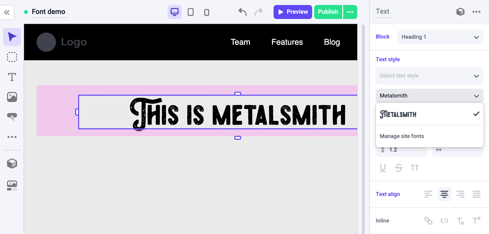
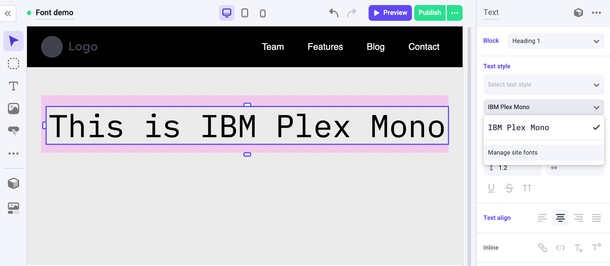
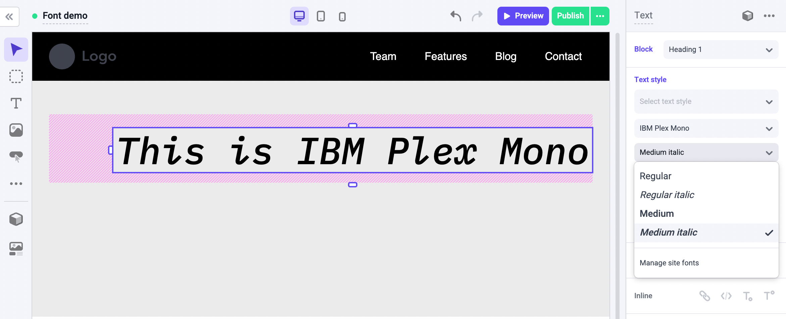
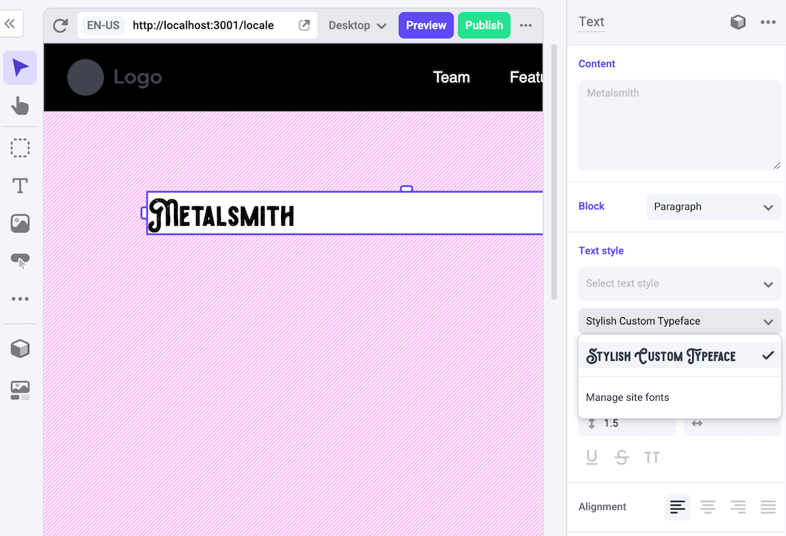

## Types

```ts
type MakeswiftApiHandlerConfig = {
  getFonts?: () => Fonts | Promise<Fonts>
}

type Fonts = Font[]

type Font = {
  family: string
  label?: string
  variants: FontVariant[]
}

type FontVariant = {
  weight: string
  style: 'italic' | 'normal'
  src?: string
}
``` 
## Examples

### Registering a custom font

In this example, we have a custom font installed called `Metalsmith` that's located in `public/fonts/Metalsmith.woff`.
We can register this font by modifying [`MakeswiftApiHandler`](/guides/manual-installation#add-the-makeswift-api-handler) located in `pages/api/makeswift/[...makeswift].ts`.:

```jsx
export default MakeswiftApiHandler('<makeswift_site_api_key>', {
  getFonts: () => [
    {
      family: 'Metalsmith',
      variants: [{ weight: '400', style: 'normal', src: '/fonts/Metalsmith.woff' }],
    },
  ],
})
```

Once we do that, we can use the font in the builder:



The `src` field is optional. It will be used to load the font and preview the font in the dropdown.
The `src` field could be either a relative URL or an absolute URL. If you don't provide the `src` field, the font won't be loaded
in the font selection dropdown, but you can still select the font like normal.

Note that adding the font to [`MakeswiftApiHandler`](/guides/manual-installation#add-the-makeswift-api-handler) will **only** make
the font be available in the Makeswift builder. Make sure that you already installed
the font manually in your Next.js app. One way to do it is by adding this code to `global.css` file:

```css
@font-face {
  font-family: 'Metalsmith';
  src: url('/fonts/Metalsmith.woff') format('woff');
}
```

### Registering a Google Font

In this example, we have a Google Font installed called `IBM Plex Mono`. We can register this font by modifying
[`MakeswiftApiHandler`](/guides/manual-installation#add-the-makeswift-api-handler) located in `pages/api/makeswift/[...makeswift].ts`.:

```js
export default MakeswiftApiHandler('<makeswift_site_api_key>', {
  getFonts: () => [
    {
      family: 'IBM Plex Mono',
      variants: [{ weight: '400', style: 'normal' }],
    },
  ],
})
```

Once we do that, we can use the font in the builder:



When you register a font that's available on Google Font, we'll load the font automatically so you don't have to provide the `src` field.

Note that adding the font to [`MakeswiftApiHandler`](/guides/manual-installation#add-the-makeswift-api-handler) will **only** make
the font be available in the Makeswift builder. Make sure that you already installed
the font manually in your Next.js app. One way to do it is by adding this code to a [`Custom Document <Head/>`](/guides/extending-the-custom-document):

```html
<link href="https://fonts.googleapis.com/css2?family=IBM+Plex+Mono&display=swap" rel="stylesheet" />
```

### Registering a font with many variants

In this example, we have Google Font installed called `IBM Plex Mono` with many variants. We can register this font by modifying
[`MakeswiftApiHandler`](/guides/manual-installation#add-the-makeswift-api-handler) located in `pages/api/makeswift/[...makeswift].ts`.:

```js
export default MakeswiftApiHandler('<makeswift_site_api_key>', {
  getFonts: () => [
    {
      family: 'IBM Plex Mono',
      variants: [
        { weight: '400', style: 'normal' },
        { weight: '400', style: 'italic' },
        { weight: '500', style: 'normal' },
        { weight: '500', style: 'italic' },
      ],
    },
  ],
})
```

Once we do that, we can use the variant in the builder:



We'll convert each variant into a readable format:

| Weight | Label       |
| ------ | ----------- |
| 100    | Thin        |
| 200    | Extra light |
| 300    | Light       |
| 400    | Regular     |
| 500    | Medium      |
| 600    | Semi bold   |
| 700    | Bold        |
| 800    | Extra bold  |
| 900    | Black       |

Note that adding the font to [`MakeswiftApiHandler`](/guides/manual-installation#add-the-makeswift-api-handler) will **only** make
the font be available in the Makeswift builder. Make sure that you already installed
the font manually in your Next.js app. One way to do it is by adding this code to a [`Custom Document <Head/>`](/guides/extending-the-custom-document):

```html
<link
  href="https://fonts.googleapis.com/css2?family=IBM+Plex+Mono:ital,wght@0,400;0,500;1,400;1,500&display=swap"
  rel="stylesheet"
/>
```

### Custom label

The builder will use the `family` value in the font family dropdown by default. To add a custom label, use the `label` option.

```jsx
export default MakeswiftApiHandler('<makeswift_site_api_key>', {
  getFonts: () => [
    {
      family: 'Metalsmith',
      label: 'Stylish Custom Typeface',
      variants: [{ weight: '400', style: 'normal', src: '/fonts/Metalsmith.woff' }],
    },
  ],
})
```

